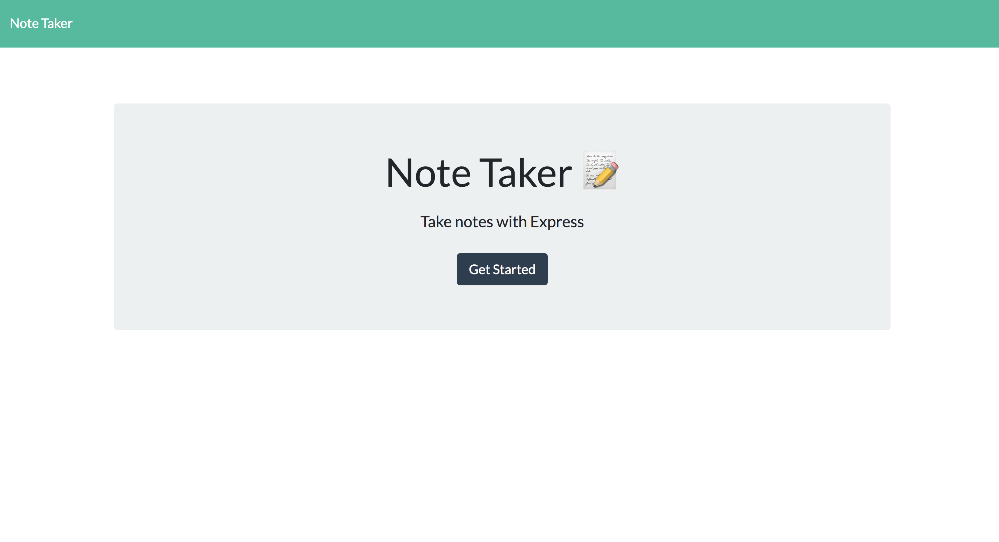
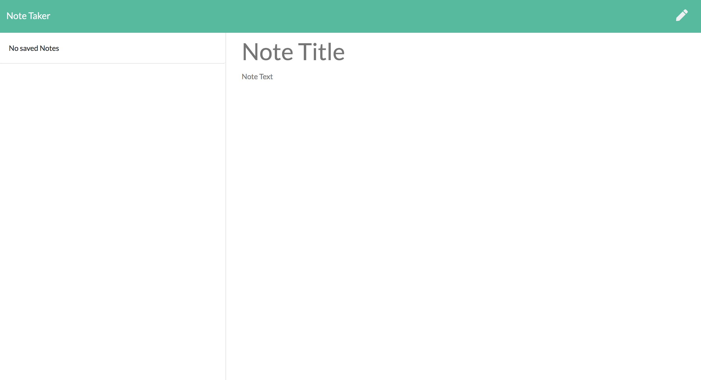
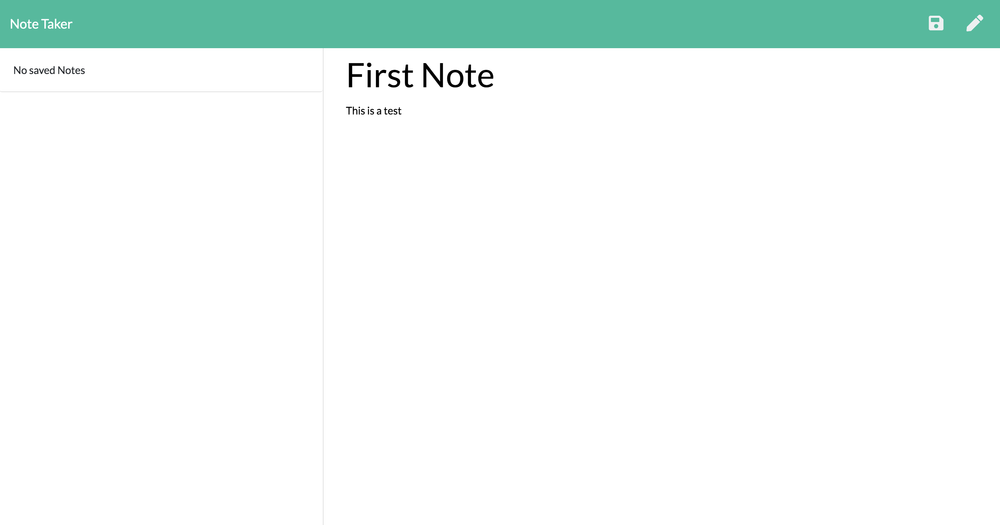
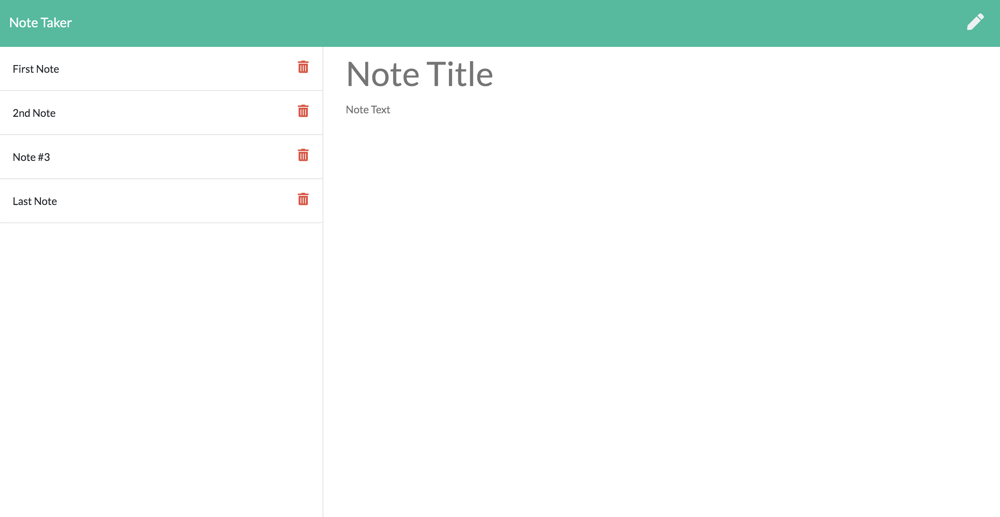
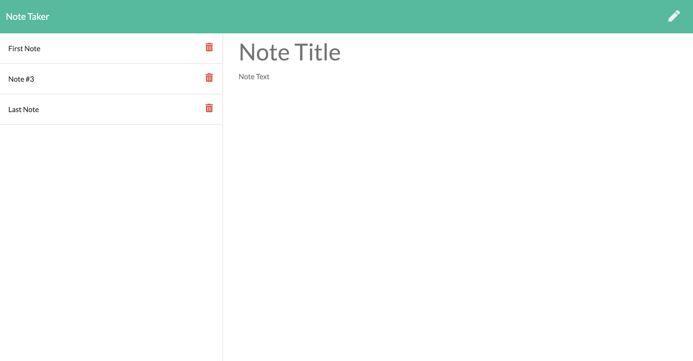

# Jot Note Save JNS 

## Deployed application

Application: [Jot Note Save](https://jot-note-save.herokuapp.com/)

## Description
Jot Note Save (JNS), is an easy to use note taking application. It allows user to enter a note, including a title and body, and save the note to a database. Upon saving thier notes users will see their notes populated to the left of the application. JNS also allows users to delete a note once it is no longer required. 

## Table of Contents
        
- [User Story](#User-Story)
- [Acceptance Criteria](#Acceptance-Criteria)
- [Technologies Used](#technologies-used)
- [Screenshots](#screenshots)
- [Questions](#Questions)
- [License](#license)

## User Story

```
AS A small business owner
I WANT to be able to write and save notes
SO THAT I can organize my thoughts and keep track of tasks I need to complete
```


## Acceptance Criteria

```
GIVEN a note-taking application
WHEN I open the Note Taker
THEN I am presented with a landing page with a link to a notes page
WHEN I click on the link to the notes page
THEN I am presented with a page with existing notes listed in the left-hand column, plus empty fields to enter a new note title and the note’s text in the right-hand column
WHEN I enter a new note title and the note’s text
THEN a Save icon appears in the navigation at the top of the page
WHEN I click on the Save icon
THEN the new note I have entered is saved and appears in the left-hand column with the other existing notes
WHEN I click on an existing note in the list in the left-hand column
THEN that note appears in the right-hand column
WHEN I click on the Write icon in the navigation at the top of the page
THEN I am presented with empty fields to enter a new note title and the note’s text in the right-hand column
```
        
## Technologies Used

```
Node.js
NPM
Express.js
Javascript
HTML
CSS
```
## Screenshots







## Questions       
If you have any questions please contact me by email or through my GitHub profile
        
* Email: ashquinngordon@gmail.com
        
## License      
Licensed under the Mozilla Public License 2.0 license. Use the following link for permissions and allowances:
https://opensource.org/licenses/MPL-2.0